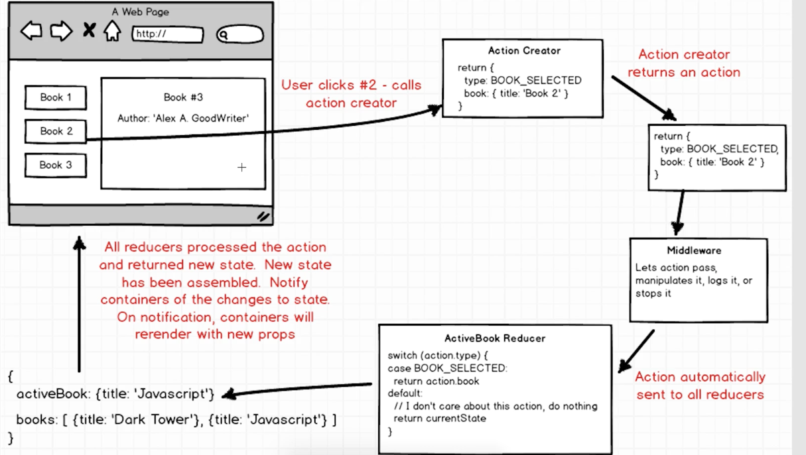

# Weather React App


## Open Weather Map API
[free API](https://openweathermap.org/api)

- API call:
```
api.openweathermap.org/data/2.5/forecast?q={city name},{country code}
```

## Ajax Request on Redux (Middleware)


#### Middleware is a DoorKeeper
Middleware is our functions that take an action. Dependin on the actions type and payload(or other values), the Middleware cound let the action pass through, manipulate the action, console.log it or stop it all together befroe actions reach any Reducer.

#### Redux Promise
[Redux-promise](https://www.npmjs.com/package/redux-promise)

- applyMiddleware
```js
import { createStore, applyMiddleware } from 'redux';
import ReduxPromise from 'redux-promise'


const createStoreWithMiddleware = applyMiddleware(ReduxPromise)(createStore);
```

### Action: API Request to fetch Weather API Data
- new funtion to fetch weather: In order to avoid others' typo or changes, we give a type of action not just a Strgin
- We will import this type in the reducer as well
```js
export const FETCH_WEATHER = 'FETCH_WEATHER';
```

- Template String
```js
const ROOT_URL = `http://samples.openweathermap.org/data/2.5/forecast?appid=${API_KEY}`;
```
#### axios :Library for asking Ajax Request
[axios](https://www.npmjs.com/package/axios)
- Will Return a Promise 
```js
  const request = axios.get(url);

  return {
    type: FETCH_WEATHER,
    payload: request
};
```


## Components
### Search Bar
Container: Need to have the ability to modify the state of our application by depatching action right and to call all action creator needs to say like hey someone just enter the search term, we need to call a API request.

#### onChange Event
- Event Handler : onImputChange(event)
- Need a component State to record the current Input term
- Initize the input term with ''
```js
  onInputChange(event){
    console.log(event.target.value);
    this.setState({ term: event.target.value });
  }

<input
    placeholder = " Get a five-days forecast in your favorite cities"
    className = "form-control"
    value = {this.state.term}
    onChange = {this.onInputChange}
    />
```

#### onSubimt Event
- Prevent Browser to automatically submit the from 
```js
  onFormSubmit(event){
      event.preventDefault();
  }
```

#### Bind This
- Handle the Error of 'this', Since when we write " conChange = {this.onInputChagne} ", the call back function onInputChange reference to a 'this' and the callback function doesn't know what "this" means. The 'this' is not going to be our search component. 
```
Uncaught TypeError: Cannot read property 'setState' of undefined
```
```js
this.onInputChange = this.onInputChange.bind(this);
```

#### ForcastList

#### Chart